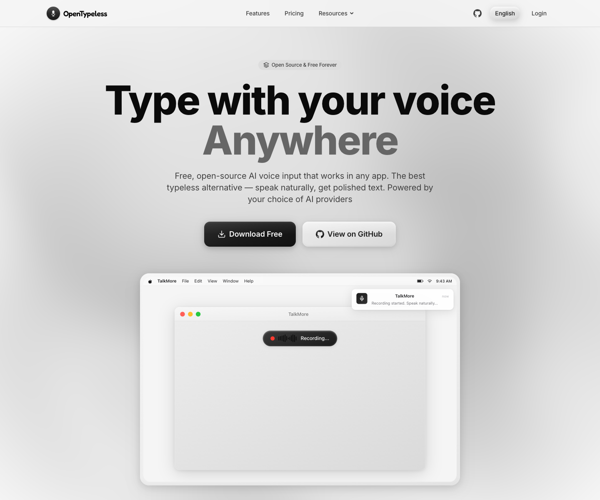
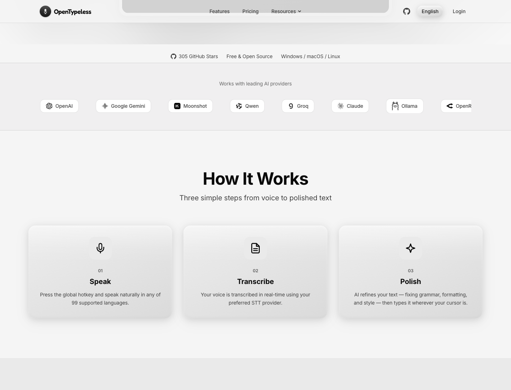
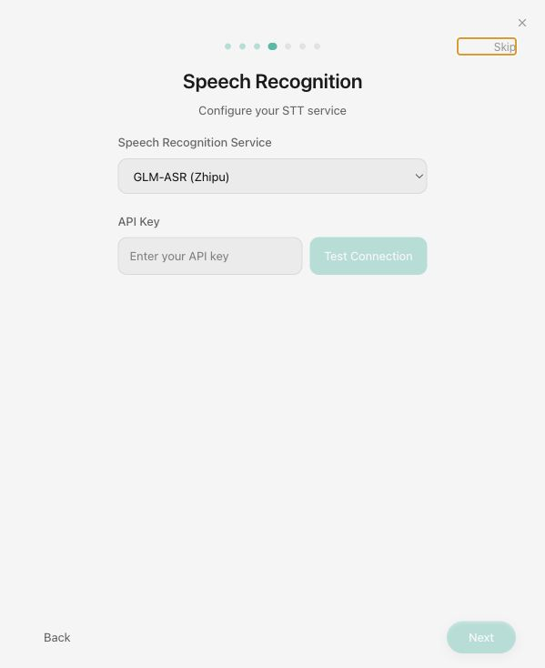
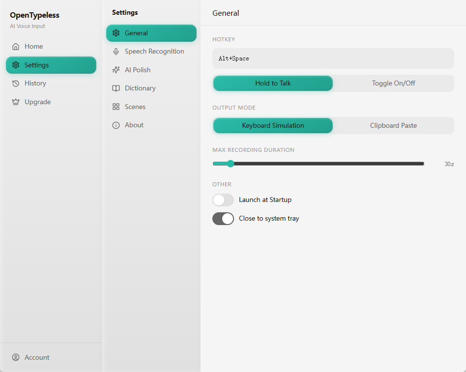
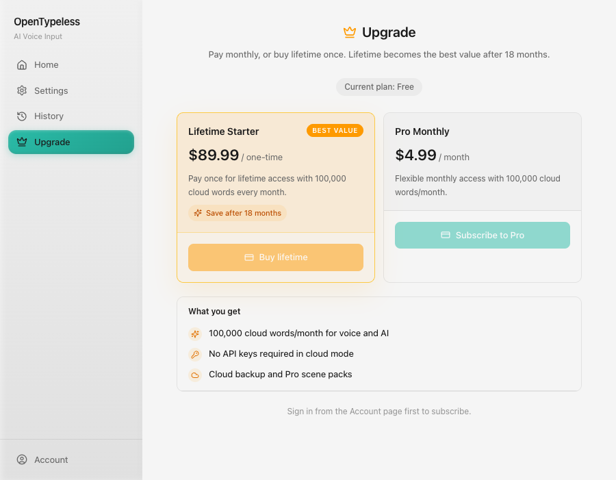
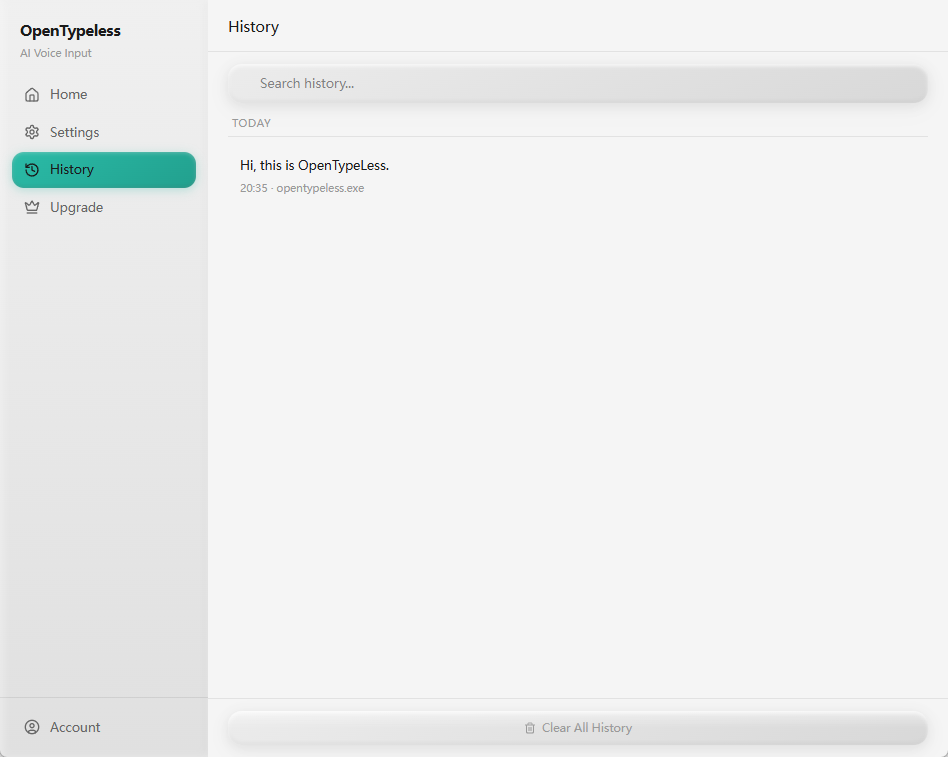
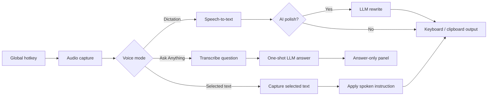
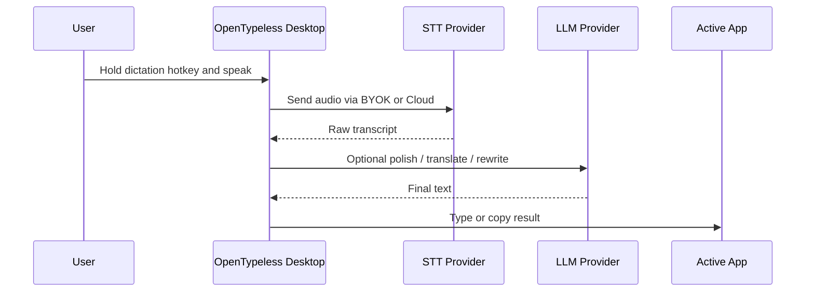
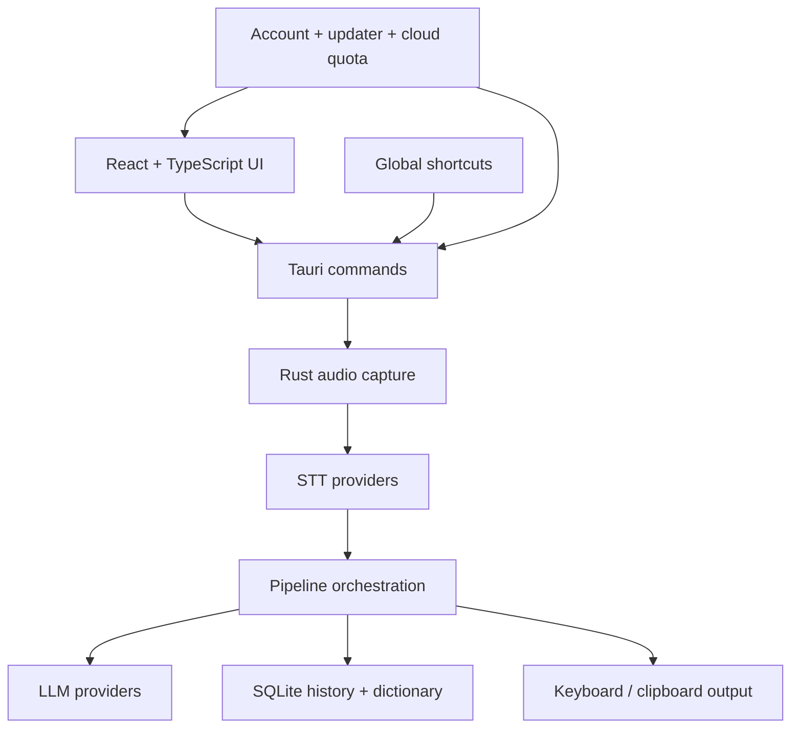

<p align="center">
  <strong>English</strong> | <a href="README_zh.md">中文</a> | <a href="README_ja.md">日本語</a> | <a href="README_ko.md">한국어</a> | <a href="README_es.md">Español</a> | <a href="README_fr.md">Français</a> | <a href="README_de.md">Deutsch</a> | <a href="README_pt.md">Português</a> | <a href="README_ru.md">Русский</a> | <a href="README_ar.md">العربية</a> | <a href="README_hi.md">हिन्दी</a> | <a href="README_it.md">Italiano</a> | <a href="README_tr.md">Türkçe</a> | <a href="README_vi.md">Tiếng Việt</a> | <a href="README_th.md">ภาษาไทย</a> | <a href="README_id.md">Bahasa Indonesia</a> | <a href="README_pl.md">Polski</a> | <a href="README_nl.md">Nederlands</a>
</p>

<p align="center">
  
</p>

<h1 align="center">OpenTypeless</h1>

<p align="center">
  Open-source AI voice input, rewriting, and voice Q&A for macOS, Windows, and Linux.
</p>

<p align="center">
  Press a hotkey, speak naturally, and get clean text in the app you are already using.<br/>
  Or ask a one-shot voice question and get a concise AI answer without opening a chat app.
</p>

<p align="center">
  <a href="https://github.com/tover0314-w/opentypeless/actions/workflows/ci.yml"></a>
  <a href="https://github.com/tover0314-w/opentypeless/releases"></a>
  <a href="LICENSE"></a>
  <a href="https://github.com/tover0314-w/opentypeless/stargazers"></a>
  <a href="https://discord.gg/V6rRpJ4RGD"></a>
</p>

<p align="center">
  <a href="https://www.opentypeless.com"><strong>Website</strong></a> ·
  <a href="https://github.com/tover0314-w/opentypeless/releases"><strong>Download</strong></a> ·
  <a href="#getting-started"><strong>Run locally</strong></a> ·
  <a href="https://github.com/tover0314-w/opentypeless/discussions"><strong>Discussions</strong></a>
</p>

<p align="center">
  
</p>

<p align="center">
  <strong>Dictate anywhere</strong> · <strong>Rewrite selected text</strong> · <strong>Ask one-shot voice questions</strong> · <strong>Bring your own keys or use managed cloud words</strong>
</p>

## Ask Anything

Ask Anything is a shortcut-first voice Q&A flow, not a chat tab. Press the Ask Anything hotkey, speak a question, stop recording, and OpenTypeless transcribes it, sends a one-shot request to the LLM, then shows only the final answer in a small result panel.

It is designed for quick answers with no chat history, no input box, and no extra send step.

## Visual Tour

<p align="center">
  
</p>

<p align="center">
  
</p>

| Onboarding                                                                             | Settings                                                                           |
| -------------------------------------------------------------------------------------- | ---------------------------------------------------------------------------------- |
|  |  |

| Lifetime cloud words                                                                                        | Local history                                                                           |
| ----------------------------------------------------------------------------------------------------------- | --------------------------------------------------------------------------------------- |
|  |  |

---

## What OpenTypeless Does

OpenTypeless gives you three voice-first desktop workflows:

| Workflow              | What happens                                                                                                           |
| --------------------- | ---------------------------------------------------------------------------------------------------------------------- |
| Dictation             | Hold a hotkey, speak, transcribe, optionally polish with an LLM, then type or copy the result into the active app      |
| Ask Anything          | Start a one-shot voice question, transcribe it, send it to the LLM, and show only the final answer in a small panel    |
| Selected-text editing | Select text in another app, speak an instruction, and let the LLM rewrite, summarize, translate, or fix that selection |

Use it for emails, chat replies, meeting notes, issue comments, prompts, documentation drafts, quick answers, multilingual translation, and any workflow where speaking is faster than typing.



## Why OpenTypeless?

Most desktop dictation tools stop at transcription. OpenTypeless adds the AI rewrite layer, provider choice, and open-source control that power users need.

|                        | OpenTypeless                                                         | macOS Dictation | Windows Voice Typing | Whisper Desktop |
| ---------------------- | -------------------------------------------------------------------- | --------------- | -------------------- | --------------- |
| AI text polishing      | ✅ Multiple LLMs                                                     | ❌              | ❌                   | ❌              |
| Ask Anything voice Q&A | ✅                                                                   | ❌              | ❌                   | ❌              |
| STT provider choice    | ✅ Cloud, Deepgram, AssemblyAI, Whisper-compatible, Doubao, and more | ❌ Apple only   | ❌ Microsoft only    | ❌ Whisper only |
| Works in any app       | ✅                                                                   | ✅              | ✅                   | ❌ Copy-paste   |
| Translation mode       | ✅                                                                   | ❌              | ❌                   | ❌              |
| Selected-text rewrite  | ✅                                                                   | ❌              | ❌                   | ❌              |
| Open source            | ✅ MIT                                                               | ❌              | ❌                   | ✅              |
| Cross-platform         | ✅ Win/Mac/Linux                                                     | ❌ Mac only     | ❌ Windows only      | ✅              |
| Custom dictionary      | ✅                                                                   | ❌              | ❌                   | ❌              |
| Self-hostable          | ✅ BYOK                                                              | ❌              | ❌                   | ✅              |

## Features

| Area              | Highlights                                                                                                                                  |
| ----------------- | ------------------------------------------------------------------------------------------------------------------------------------------- |
| Voice capture     | Global hotkeys, hold-to-record or toggle mode, floating always-on-top capsule, separate Ask Anything shortcut                               |
| AI rewriting      | Streaming polish, selected-text context, custom polish instructions, per-app formatting, translation mode                                   |
| Ask Anything      | One-shot voice question flow: record, transcribe, think, then show only the answer                                                          |
| STT providers     | Cloud STT, Deepgram, AssemblyAI, GLM-ASR, OpenAI Whisper, Groq Whisper, SiliconFlow, Volcengine Doubao, custom Whisper-compatible endpoints |
| LLM providers     | Cloud LLM or OpenAI-compatible APIs including OpenAI, DeepSeek, Claude via OpenRouter, Gemini, Groq, Qwen, Moonshot, Ollama, and more       |
| Output            | Keyboard simulation or clipboard output, with Wayland-safe copy-only behavior where global input automation is restricted                   |
| Language          | Auto-detect speech, translate into 20+ target languages, customize domain vocabulary                                                        |
| Account and quota | Optional Pro and Lifetime Starter plans with shared cloud words for voice and AI                                                            |
| Desktop polish    | Dark/light/system theme, onboarding, local history search, auto-start, auto-update, cross-platform Tauri app                                |

## How The App Thinks



> [!TIP]
> **Recommended Configuration for Best Experience**
>
> |              | Provider | Model                    |
> | ------------ | -------- | ------------------------ |
> | 🗣️ STT       | Groq     | `whisper-large-v3-turbo` |
> | 🤖 AI Polish | Google   | `gemini-2.5-flash`       |
>
> This combo delivers fast, accurate transcription with high-quality text polishing — and both offer generous free tiers.

## Try It in 5 Minutes

1. Download the latest build for your platform from [Releases](https://github.com/tover0314-w/opentypeless/releases).
2. Choose **BYOK** for full provider control or **Cloud** if you want managed quota without API keys.
3. Pick speech recognition and AI polish providers in Settings.
4. Set your dictation and Ask Anything hotkeys.
5. Open any desktop app, press the hotkey, speak, and let OpenTypeless type the polished result.

## Download

Download the latest version for your platform:

**[Download from Releases](https://github.com/tover0314-w/opentypeless/releases)**

| Platform | File                                         |
| -------- | -------------------------------------------- |
| Windows  | `.msi` installer or `.exe` setup             |
| macOS    | Universal `.dmg` for Apple Silicon and Intel |
| Linux    | `.AppImage` / `.deb` / `.rpm`                |

## Installation Notes

Release signing differs by platform while distribution is being improved. Always download from the official [GitHub Releases](https://github.com/tover0314-w/opentypeless/releases) page.

### Windows

Windows SmartScreen may show "Windows protected your PC":

1. Click **More info**
2. Click **Run anyway**

If the installer shows a publisher validation warning:

1. Right-click the `.msi` file → **Properties**
2. Check **Unblock** at the bottom → **Apply**
3. Run the installer again

### macOS

macOS builds are Developer ID signed. If Gatekeeper still blocks first launch while notarization/stapling catches up, remove the quarantine attribute:

```bash
xattr -cr /Applications/OpenTypeless.app
```

Then open the app normally.

### Linux

**Ubuntu/Debian** — install the `.deb` package:

```bash
sudo apt install ./OpenTypeless_x.x.x_amd64.deb
```

**AppImage** — make it executable and run:

```bash
chmod +x OpenTypeless_x.x.x_amd64.AppImage
./OpenTypeless_x.x.x_amd64.AppImage
```

**NVIDIA + Wayland users:** The app auto-detects this configuration and applies a workaround. If it still crashes on startup, run:

```bash
WEBKIT_DISABLE_DMABUF_RENDERER=1 ./OpenTypeless
```

**Wayland users:** global hotkeys and automatic paste are limited by the desktop environment. OpenTypeless shows this in Settings and falls back to tray/app controls or copy-only clipboard output where needed.

## Prerequisites

- [Node.js](https://nodejs.org/) 20+
- [Rust](https://rustup.rs/) (stable toolchain)
- Platform-specific dependencies for Tauri: see [Tauri Prerequisites](https://v2.tauri.app/start/prerequisites/)

## Getting Started

```bash
# Install dependencies
npm install

# Run in development mode
npm run tauri dev

# Build for production
npm run tauri build
```

The built application will be in `src-tauri/target/release/bundle/`.

## Configuration

All settings are accessible from the in-app Settings panel:

- **Speech Recognition** — choose STT provider and enter your API key
- **AI Polish** — choose LLM provider, model, API key, custom polish instructions, translation, and selected-text context
- **General** — dictation hotkey, Ask Anything hotkey, output mode, theme, auto-start
- **Dictionary** — add custom terms for better transcription accuracy
- **Scenes** — prompt templates for different use cases
- **Account / Upgrade** — sign in, check cloud words, manage Pro or Lifetime Starter access

API keys are stored locally via `tauri-plugin-store`. No keys are sent to OpenTypeless servers — all STT/LLM requests go directly to the provider you configure.

### Cloud Option

OpenTypeless also offers optional managed cloud access so you do not need your own provider keys. Pro and Lifetime Starter plans include shared cloud words for speech recognition and AI rewriting. BYOK remains fully supported.

[Learn more about Pro](https://www.opentypeless.com)

### BYOK vs Cloud

|                  | BYOK Mode                                        | Cloud (Pro) Mode                            |
| ---------------- | ------------------------------------------------ | ------------------------------------------- |
| STT              | Your own API key or local endpoint               | Managed cloud words                         |
| LLM              | Your own API key or local endpoint               | Managed cloud words                         |
| Cloud dependency | None — all requests go directly to your provider | Requires connection to www.opentypeless.com |
| Cost             | Pay your provider directly                       | Optional Pro or Lifetime Starter            |

All core features — recording, transcription, AI polish, keyboard/clipboard output, dictionary, history — work entirely offline from OpenTypeless servers in BYOK mode.

### Self-Hosting / No Cloud

To run OpenTypeless without any cloud dependency:

1. Choose any non-Cloud STT and LLM provider in Settings
2. Enter your own API keys
3. That's it — no account or internet connection to www.opentypeless.com is needed

If you want to point the optional cloud features at your own backend, set these environment variables before building:

| Variable            | Default                        | Description                     |
| ------------------- | ------------------------------ | ------------------------------- |
| `VITE_API_BASE_URL` | `https://www.opentypeless.com` | Frontend cloud API base URL     |
| `API_BASE_URL`      | `https://www.opentypeless.com` | Rust backend cloud API base URL |

```bash
# Example: build with a custom backend
VITE_API_BASE_URL=https://my-server.example.com API_BASE_URL=https://my-server.example.com npm run tauri build
```

## Architecture

**Desktop pipeline:**



```
src/                  # React frontend (TypeScript)
├── components/       # UI components (Settings, History, Capsule, etc.)
├── hooks/            # React hooks (recording, theme, Tauri events)
├── lib/              # Utilities (API client, router, constants)
└── stores/           # Zustand state management

src-tauri/src/        # Rust backend
├── audio/            # Audio capture via cpal
├── stt/              # STT providers (Deepgram, AssemblyAI, Whisper-compat, Cloud)
├── llm/              # LLM providers (OpenAI-compat, Cloud)
├── output/           # Text output (keyboard simulation, clipboard paste)
├── storage/          # Config (tauri-plugin-store) + history/dictionary (SQLite)
├── app_detector/     # Detect active application for context
├── pipeline.rs       # Recording → STT → LLM → Output orchestration
└── lib.rs            # Tauri app setup, commands, hotkey handling
```

## Roadmap

- [ ] Usage summary UI for aggregate audio time and word counts
- [ ] More provider-specific setup diagnostics
- [ ] Better Linux desktop-environment guidance
- [ ] More workflow presets for writing, coding, and support replies
- [ ] Plugin-style provider extensions

## FAQ

**Is my audio sent to the cloud?**
In BYOK mode, audio goes directly to your chosen STT provider or local endpoint. Nothing passes through OpenTypeless servers. In Cloud mode, audio is sent to the managed proxy for transcription and quota accounting.

**Can I use it offline?**
With a local Whisper-compatible STT endpoint and a local OpenAI-compatible LLM such as Ollama, the app can run without OpenTypeless cloud services.

**Which languages are supported?**
STT supports 99+ languages depending on the provider. AI polish and translation support 20+ target languages.

**Is the app free?**
Yes. The app is fully functional with your own API keys (BYOK). Cloud plans are optional.

## Community

- 💬 [Discord](https://discord.gg/V6rRpJ4RGD) — Chat, get help, share feedback
- 🗣️ [GitHub Discussions](https://github.com/tover0314-w/opentypeless/discussions) — Feature proposals, Q&A
- 🐛 [Issue Tracker](https://github.com/tover0314-w/opentypeless/issues) — Bug reports and feature requests
- 📖 [Contributing Guide](CONTRIBUTING.md) — Development setup and guidelines
- 🔒 [Security Policy](SECURITY.md) — Report vulnerabilities responsibly
- 🧭 [Vision](VISION.md) — Project principles and roadmap direction

## Contributing

Contributions are welcome! See [CONTRIBUTING.md](CONTRIBUTING.md) for development setup and guidelines.

Looking for a place to start? Check out issues labeled [`good first issue`](https://github.com/tover0314-w/opentypeless/labels/good%20first%20issue).

## Star History

<a href="https://star-history.com/#tover0314-w/opentypeless&Date">
  <picture>
    <source media="(prefers-color-scheme: dark)" srcset="https://api.star-history.com/svg?repos=tover0314-w/opentypeless&type=Date&theme=dark" />
    <source media="(prefers-color-scheme: light)" srcset="https://api.star-history.com/svg?repos=tover0314-w/opentypeless&type=Date" />
    
  </picture>
</a>

## Built With

- [Tauri](https://tauri.app/) for the desktop shell
- [React](https://react.dev/) and [TypeScript](https://www.typescriptlang.org/) for the UI
- [Rust](https://www.rust-lang.org/) for audio capture, providers, hotkeys, output, and local storage
- [i18next](https://www.i18next.com/) for multilingual UI

## License

[MIT](LICENSE)
