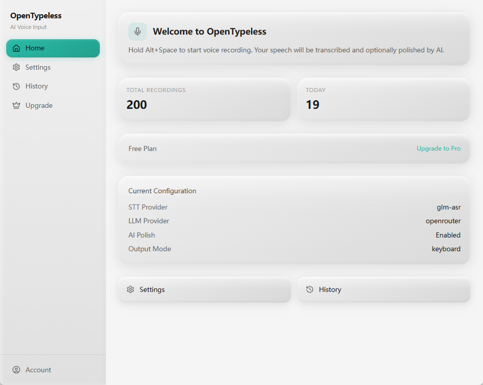
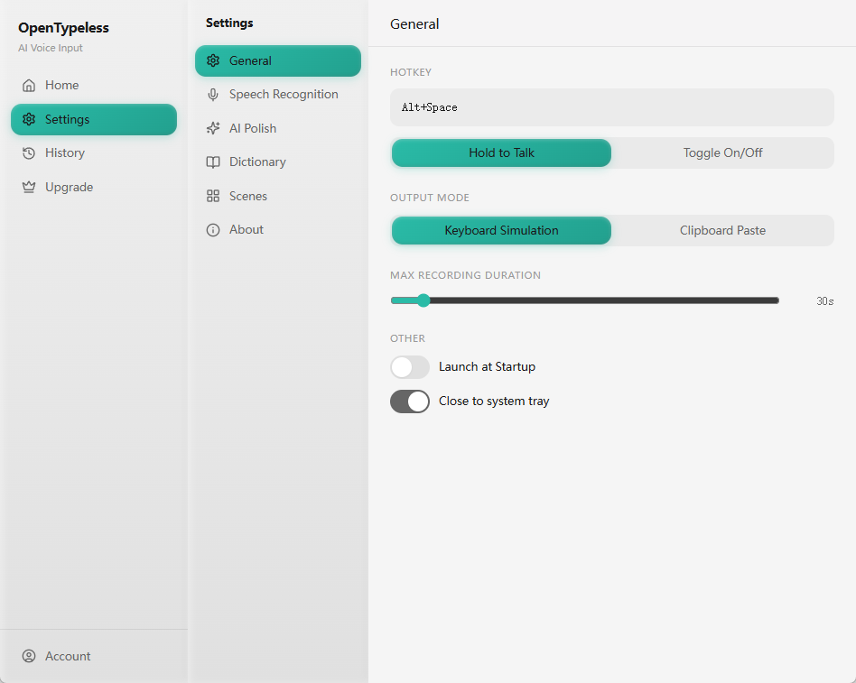
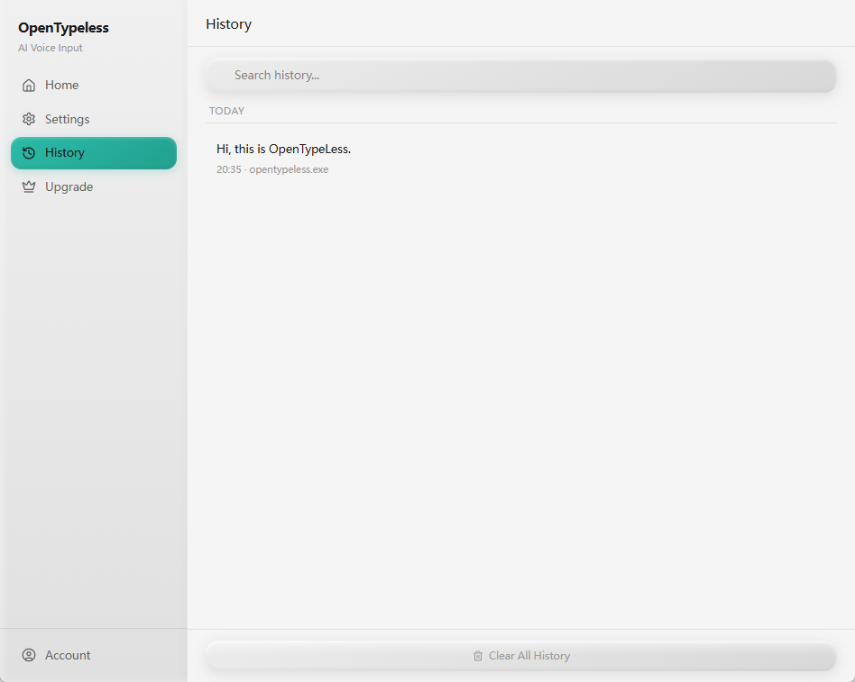

<p align="center">
  <a href="README.md">English</a> | <a href="README_zh.md">中文</a> | <a href="README_ja.md">日本語</a> | <a href="README_ko.md">한국어</a> | <a href="README_es.md">Español</a> | <strong>Français</strong> | <a href="README_de.md">Deutsch</a> | <a href="README_pt.md">Português</a>
</p>

<p align="center">
  
</p>

<h1 align="center">OpenTypeless</h1>

<p align="center">
  Saisie vocale IA open source pour le bureau. Parlez naturellement, obtenez du texte soigné dans n'importe quelle application.
</p>

<p align="center">
  <a href="https://github.com/tover0314-w/opentypeless/actions/workflows/ci.yml"></a>
  <a href="https://github.com/tover0314-w/opentypeless/releases"></a>
  <a href="LICENSE"></a>
  <a href="https://github.com/tover0314-w/opentypeless/stargazers"></a>
  <a href="https://discord.gg/V6rRpJ4RGD"></a>
</p>

<p align="center">
  
</p>

<details>
<summary>Plus de captures d'écran</summary>

<p align="center">
  <picture>
    <source media="(prefers-color-scheme: dark)" srcset="docs/images/app-main-dark.png" />
    <source media="(prefers-color-scheme: light)" srcset="docs/images/app-main-light.png" />
    
  </picture>
</p>

| Paramètres | Historique |
|---|---|
|  |  |

</details>

---

## Pourquoi OpenTypeless ?

| | OpenTypeless | Dictée macOS | Saisie vocale Windows | Whisper Desktop |
|---|---|---|---|---|
| Polissage de texte par IA | ✅ Multiples LLMs | ❌ | ❌ | ❌ |
| Choix du fournisseur STT | ✅ 6+ fournisseurs | ❌ Apple uniquement | ❌ Microsoft uniquement | ❌ Whisper uniquement |
| Fonctionne dans toute application | ✅ | ✅ | ✅ | ❌ Copier-coller |
| Mode traduction | ✅ | ❌ | ❌ | ❌ |
| Open source | ✅ MIT | ❌ | ❌ | ✅ |
| Multiplateforme | ✅ Win/Mac/Linux | ❌ Mac uniquement | ❌ Windows uniquement | ✅ |
| Dictionnaire personnalisé | ✅ | ❌ | ❌ | ❌ |
| Auto-hébergeable | ✅ BYOK | ❌ | ❌ | ✅ |

## Fonctionnalités

- 🎙️ Raccourci global — maintenir pour enregistrer ou basculer
- 💊 Widget capsule flottant, toujours au premier plan
- 🗣️ 6+ fournisseurs STT : Deepgram, AssemblyAI, Whisper, Groq, GLM-ASR, SiliconFlow
- 🤖 Polissage de texte via plusieurs LLMs : OpenAI, DeepSeek, Claude, Gemini, Ollama, etc.
- ⚡ Sortie en streaming — le texte apparaît au fur et à mesure de la génération
- ⌨️ Sortie par simulation clavier ou presse-papiers
- 📝 Sélectionnez du texte avant d'enregistrer pour donner du contexte au LLM
- 🌐 Mode traduction : parlez dans une langue, obtenez la sortie dans une autre (20+ langues)
- 📖 Dictionnaire personnalisé pour les termes spécialisés
- 🔍 Détection par application pour adapter le formatage
- 📜 Historique local avec recherche en texte intégral
- 🌗 Thème sombre / clair / système
- 🚀 Démarrage automatique à la connexion

> [!TIP]
> **Configuration recommandée pour la meilleure expérience**
>
> | | Fournisseur | Modèle |
> |---|---|---|
> | 🗣️ STT | Groq | `whisper-large-v3-turbo` |
> | 🤖 Polissage IA | Google | `gemini-2.5-flash-preview` |
>
> Cette combinaison offre une transcription rapide et précise avec un polissage de texte de haute qualité — et les deux proposent des niveaux gratuits généreux.

## Prérequis

- [Node.js](https://nodejs.org/) 20+
- [Rust](https://rustup.rs/) (toolchain stable)
- Dépendances spécifiques à la plateforme pour Tauri : voir [Prérequis Tauri](https://v2.tauri.app/start/prerequisites/)

## Démarrage rapide

```bash
# Installer les dépendances
npm install

# Exécuter en mode développement
npm run tauri dev

# Compiler pour la production
npm run tauri build
```

L'application compilée se trouvera dans `src-tauri/target/release/bundle/`.

## Configuration

Tous les paramètres sont accessibles depuis le panneau Paramètres de l'application :

- **Reconnaissance vocale** — choisissez le fournisseur STT et entrez votre clé API
- **Polissage IA** — choisissez le fournisseur LLM, le modèle et la clé API
- **Général** — raccourci, mode de sortie, thème, démarrage automatique
- **Dictionnaire** — ajoutez des termes personnalisés pour une meilleure précision de transcription
- **Scènes** — modèles de prompts pour différents cas d'utilisation

Les clés API sont stockées localement via `tauri-plugin-store`. Aucune clé n'est envoyée aux serveurs OpenTypeless — toutes les requêtes STT/LLM sont envoyées directement au fournisseur que vous configurez.

### Option Cloud (Pro)

OpenTypeless propose également un abonnement Pro optionnel qui fournit un quota géré de STT et LLM afin que vous n'ayez pas besoin de vos propres clés API. C'est entièrement optionnel — l'application est pleinement fonctionnelle avec vos propres clés.

### Mode BYOK vs Cloud (Pro)

| | Mode BYOK | Mode Cloud (Pro) |
|---|---|---|
| STT | Votre propre clé API (Deepgram, AssemblyAI, etc.) | Quota géré (10h/mois) |
| LLM | Votre propre clé API (OpenAI, DeepSeek, etc.) | Quota géré (~5M tokens/mois) |
| Dépendance cloud | Aucune — toutes les requêtes vont directement à votre fournisseur | Nécessite une connexion à www.opentypeless.com |
| Coût | Payez votre fournisseur directement | Abonnement 4,99 $/mois |

Toutes les fonctionnalités principales — enregistrement, transcription, polissage IA, sortie clavier/presse-papiers, dictionnaire, historique — fonctionnent entièrement sans connexion aux serveurs OpenTypeless en mode BYOK.

### Auto-hébergement / Sans cloud

Pour utiliser OpenTypeless sans aucune dépendance cloud :

1. Choisissez un fournisseur STT et LLM non-Cloud dans les Paramètres
2. Entrez vos propres clés API
3. C'est tout — aucun compte ni connexion internet à opentypeless.com n'est nécessaire

Si vous souhaitez rediriger les fonctionnalités cloud optionnelles vers votre propre backend, définissez ces variables d'environnement avant la compilation :

| Variable | Valeur par défaut | Description |
|---|---|---|
| `VITE_API_BASE_URL` | `https://www.opentypeless.com` | URL de base de l'API cloud pour le frontend |
| `API_BASE_URL` | `https://www.opentypeless.com` | URL de base de l'API cloud pour le backend Rust |

```bash
# Exemple : compiler avec un backend personnalisé
VITE_API_BASE_URL=https://my-server.example.com API_BASE_URL=https://my-server.example.com npm run tauri build
```

## Architecture

```
src/                  # Frontend React (TypeScript)
├── components/       # Composants UI (Paramètres, Historique, Capsule, etc.)
├── hooks/            # Hooks React (enregistrement, thème, événements Tauri)
├── lib/              # Utilitaires (client API, routeur, constantes)
└── stores/           # Gestion d'état Zustand

src-tauri/src/        # Backend Rust
├── audio/            # Capture audio via cpal
├── stt/              # Fournisseurs STT (Deepgram, AssemblyAI, compatible Whisper, Cloud)
├── llm/              # Fournisseurs LLM (compatible OpenAI, Cloud)
├── output/           # Sortie texte (simulation clavier, collage presse-papiers)
├── storage/          # Configuration (tauri-plugin-store) + historique/dictionnaire (SQLite)
├── app_detector/     # Détection de l'application active pour le contexte
├── pipeline.rs       # Orchestration Enregistrement → STT → LLM → Sortie
└── lib.rs            # Configuration de l'app Tauri, commandes, gestion des raccourcis
```

## Feuille de route

- [ ] Système de plugins pour intégrations STT/LLM personnalisées
- [ ] Plus de langues
- [ ] Commandes vocales
- [ ] Combinaisons de raccourcis personnalisables
- [ ] Expérience d'intégration améliorée
- [ ] Application mobile compagnon

## Communauté

- 💬 [Discord](https://discord.gg/V6rRpJ4RGD) — Discutez, obtenez de l'aide, partagez vos retours
- 🗣️ [GitHub Discussions](https://github.com/tover0314-w/opentypeless/discussions) — Propositions de fonctionnalités, questions-réponses
- 🐛 [Issue Tracker](https://github.com/tover0314-w/opentypeless/issues) — Rapports de bugs et demandes de fonctionnalités
- 📖 [Guide de contribution](CONTRIBUTING.md) — Configuration de développement et directives
- 🔒 [Politique de sécurité](SECURITY.md) — Signaler les vulnérabilités de manière responsable
- 🧭 [Vision](VISION.md) — Principes du projet et direction de la feuille de route

## Contribuer

Les contributions sont les bienvenues ! Consultez [CONTRIBUTING.md](CONTRIBUTING.md) pour la configuration de développement et les directives.

Vous cherchez par où commencer ? Consultez les issues avec le label [`good first issue`](https://github.com/tover0314-w/opentypeless/labels/good%20first%20issue).

## Historique des étoiles

<a href="https://star-history.com/#tover0314-w/opentypeless&Date">
  <picture>
    <source media="(prefers-color-scheme: dark)" srcset="https://api.star-history.com/svg?repos=tover0314-w/opentypeless&type=Date&theme=dark" />
    <source media="(prefers-color-scheme: light)" srcset="https://api.star-history.com/svg?repos=tover0314-w/opentypeless&type=Date" />
    
  </picture>
</a>

## Développé avec Claude Code en un jour

L'intégralité de ce projet a été construite en une seule journée avec [Claude Code](https://claude.com/claude-code) — de la conception de l'architecture à l'implémentation complète, incluant le backend Tauri, le frontend React, le pipeline CI/CD et ce README.

## Licence

[MIT](LICENSE)
