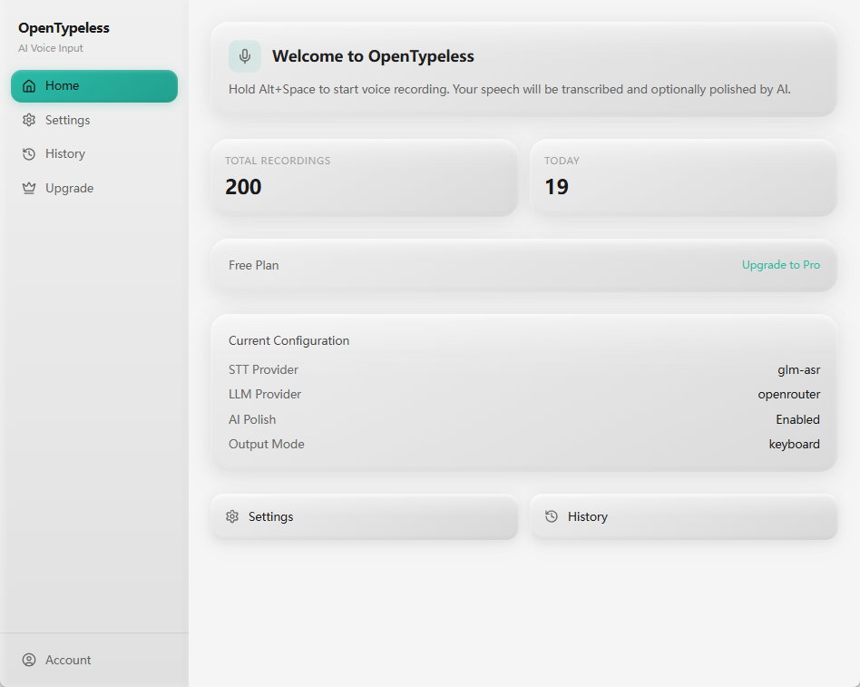
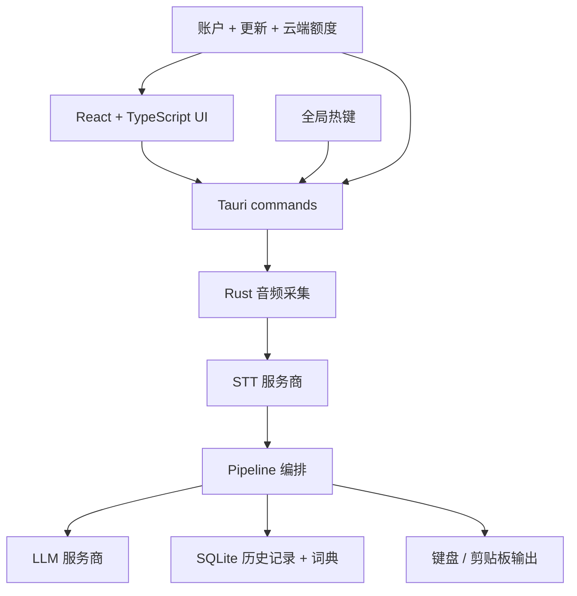

<p align="center">
  <a href="README.md">English</a> | <strong>中文</strong> | <a href="README_ja.md">日本語</a> | <a href="README_ko.md">한국어</a> | <a href="README_es.md">Español</a> | <a href="README_fr.md">Français</a> | <a href="README_de.md">Deutsch</a> | <a href="README_pt.md">Português</a> | <a href="README_ru.md">Русский</a> | <a href="README_ar.md">العربية</a> | <a href="README_hi.md">हिन्दी</a> | <a href="README_it.md">Italiano</a> | <a href="README_tr.md">Türkçe</a> | <a href="README_vi.md">Tiếng Việt</a> | <a href="README_th.md">ภาษาไทย</a> | <a href="README_id.md">Bahasa Indonesia</a> | <a href="README_pl.md">Polski</a> | <a href="README_nl.md">Nederlands</a>
</p>

<p align="center">
  
</p>

<h1 align="center">OpenTypeless</h1>

<p align="center">
  开源版 Wispr Flow / Superwhisper：面向 macOS、Windows 和 Linux 的 AI 语音输入、改写和语音问答工具。
</p>

<p align="center">
  无论你在写邮件、写代码、聊天还是做笔记 — 只需按下热键，<br/>
  说出你的想法，OpenTypeless 会用 AI 转录并润色你的语音，<br/>
  然后直接输入到你正在使用的任何应用中。
</p>

<p align="center">
  如果 OpenTypeless 对你的工作流有帮助，欢迎点一个 GitHub Star，让更多人发现这个项目。
</p>

<p align="center">
  <strong>任意应用听写</strong> · <strong>改写选中文本</strong> · <strong>语音 Ask 一次性问答</strong> · <strong>自备密钥或使用托管 cloud words</strong>
</p>

<p align="center">
  <a href="https://github.com/tover0314-w/opentypeless/actions/workflows/ci.yml"></a>
  <a href="https://github.com/tover0314-w/opentypeless/releases"></a>
  <a href="LICENSE"></a>
  <a href="https://github.com/tover0314-w/opentypeless/stargazers"></a>
  <a href="https://discord.gg/V6rRpJ4RGD"></a>
</p>

<p align="center">
  
</p>

<details>
<summary>更多截图</summary>

<p align="center">
  
</p>

| 设置 | 历史记录 |
|---|---|
|  |  |

</details>

---

## Ask Anything

Ask Anything 不是聊天页，也不是另一个输入框。它是一个快捷键优先的语音问答流程：按下 Ask 热键，说出问题，停止录音后，OpenTypeless 会先转写问题，再调用 LLM，最后只把答案显示在一个小便签里。

它适合临时问一句、快速查一句、让 AI 根据当前选中文本解释/总结/改写一句。默认没有聊天历史、没有输入框、没有额外发送按钮，结果可以直接复制。

默认热键对齐 Typeless 风格：

| 平台 | 听写 | Ask Anything | 翻译选中文本 |
|---|---|---|---|
| macOS | `Fn` | `Fn+Space` | `Fn+LeftShift` |
| Windows | `Right Alt` | `Right Alt+Space` | `Right Alt+LeftShift` |
| Linux | `Ctrl+/` | `Ctrl+.` | 可配置 |

Linux 暂时保持 `Ctrl+/` 和 `Ctrl+.` 作为默认热键，因为不同桌面环境，尤其是 Wayland 下，全局 `Right Alt` 监听不如 Windows 稳定。

## 为什么选择 OpenTypeless？

| | OpenTypeless | macOS 听写 | Windows 语音输入 | Whisper Desktop |
|---|---|---|---|---|
| AI 文本润色 | ✅ 多种 LLM | ❌ | ❌ | ❌ |
| Ask Anything 语音问答 | ✅ | ❌ | ❌ | ❌ |
| STT 服务商选择 | ✅ Cloud、Deepgram、AssemblyAI、Whisper 兼容、Doubao 等 | ❌ 仅 Apple | ❌ 仅 Microsoft | ❌ 仅 Whisper |
| 适用于任意应用 | ✅ | ✅ | ✅ | ❌ 需复制粘贴 |
| 翻译模式 | ✅ | ❌ | ❌ | ❌ |
| 选中文本改写 | ✅ | ❌ | ❌ | ❌ |
| 开源 | ✅ MIT | ❌ | ❌ | ✅ |
| 跨平台 | ✅ Win/Mac/Linux | ❌ 仅 Mac | ❌ 仅 Windows | ✅ |
| 自定义词典 | ✅ | ❌ | ❌ | ❌ |
| 可自托管 | ✅ BYOK | ❌ | ❌ | ✅ |

## 功能特性

- 🎙️ 默认对齐 Typeless 风格热键：macOS `Fn`，Windows `Right Alt`，Linux `Ctrl+/`
- ❓ 独立 Ask Anything 热键：macOS `Fn+Space`，Windows `Right Alt+Space`，Linux `Ctrl+.`
- 💊 浮动胶囊显示准备、录音、转写、润色、Ask thinking 等状态，空闲时可自动隐藏
- 🗣️ 接入 6+ 语音识别服务商，并支持 macOS Apple Speech 与自托管 Whisper 兼容端点
- 🤖 多种大模型润色文本：OpenAI、DeepSeek、Claude、Gemini、Ollama 等
- ✨ 润色风格：轻改、清爽、结构化、专业
- ⚡ 流式输出，边生成边打字
- ⌨️ 支持键盘模拟、剪贴板粘贴/仅复制、Windows SendInput 和输出失败诊断
- 📝 Ask/润色可读取选中文本，用来提问、总结、改写或翻译
- 🌐 翻译模式：说中文，输出英文（或其他 20+ 语言）
- 📖 自定义词典和本地纠错规则，提升专业术语与常见错词处理
- 🧩 内置场景、本地自定义场景、导入导出和激活状态
- 🔐 BYOK 密钥优先存入系统密钥库，尽量避免明文保存在配置里
- 🔍 自动识别当前应用，适配不同场景
- 📜 本地历史记录，支持全文搜索
- 🌗 深色 / 浅色 / 跟随系统主题
- 🚀 开机自启

> 界面本地化目前以英文和中文最完整；其他语言包已覆盖 key，但部分新功能和高级设置仍可能回退显示英文。

> [!TIP]
> **推荐配置（开箱即用最佳体验）**
>
> | | 服务商 | 模型 |
> |---|---|---|
> | 🗣️ 语音识别 | Groq | `whisper-large-v3-turbo` |
> | 🤖 AI 润色 | Google | `gemini-2.5-flash` |
>
> 这套组合转录速度快、准确率高，文本润色质量出色，而且两者都提供慷慨的免费额度。

## 下载安装

下载适用于你平台的最新版本：

**[前往 Releases 下载](https://github.com/tover0314-w/opentypeless/releases)**

| 平台 | 文件 |
|------|------|
| Windows | `.msi` 安装包或 `.exe` 安装程序 |
| macOS | Apple Silicon 和 Intel 通用 `.dmg` |
| Linux | `.AppImage` / `.deb` / `.rpm` |

## 安装说明

各平台签名和分发方式还在持续完善。请始终从官方 [GitHub Releases](https://github.com/tover0314-w/opentypeless/releases) 下载。

### Windows

如果 Windows SmartScreen 提示“Windows 已保护你的电脑”：

1. 点击 **更多信息**
2. 点击 **仍要运行**

如果安装包出现发布者验证提示：

1. 右键 `.msi` 文件，选择 **属性**
2. 勾选底部的 **解除锁定**，点击 **应用**
3. 重新运行安装包

### macOS

macOS 构建使用 Developer ID 签名。如果首次启动仍被 Gatekeeper 拦截，可以执行：

```bash
xattr -cr /Applications/OpenTypeless.app
```

然后正常打开应用。

### Linux

**Ubuntu/Debian** 安装 `.deb`：

```bash
sudo apt install ./OpenTypeless_x.x.x_amd64.deb
```

**AppImage** 直接运行：

```bash
chmod +x OpenTypeless_x.x.x_amd64.AppImage
./OpenTypeless_x.x.x_amd64.AppImage
```

**NVIDIA + Wayland 用户：**应用会自动识别并应用兼容处理。如果仍然启动崩溃，可以尝试：

```bash
WEBKIT_DISABLE_DMABUF_RENDERER=1 ./OpenTypeless
```

**Wayland 用户：**全局热键和自动粘贴会受到桌面环境限制。OpenTypeless 会在设置中提示，并可退回到托盘/应用内控制或仅复制输出。

## 前置要求

- [Node.js](https://nodejs.org/) 20+
- [Rust](https://rustup.rs/)（stable 工具链）
- Tauri 平台依赖：参见 [Tauri 前置要求](https://v2.tauri.app/start/prerequisites/)

## 快速开始

```bash
# 安装依赖
npm install

# 开发模式运行
npm run tauri dev

# 构建生产版本
npm run tauri build
```

构建产物位于 `src-tauri/target/release/bundle/`。

## 配置

所有设置均可在应用内的设置面板中访问：

- **语音识别** — 选择 STT 服务商并输入 API 密钥
- **AI 润色** — 选择 LLM 服务商、模型、API 密钥、润色风格、自定义提示词、翻译和选中文本上下文
- **通用** — 听写热键、Ask 热键、输出模式、开机自启和胶囊空闲隐藏
- **词典** — 添加自定义术语和本地纠错规则
- **场景** — 内置/本地提示词模板，支持导入导出
- **账户 / Upgrade** — 登录、查看 cloud words、管理 Pro 或 Lifetime Starter 权益

API 密钥会优先存入系统密钥库，不支持时使用本地 fallback。BYOK 密钥不会发送到 OpenTypeless 服务器 — 所有 STT/LLM 请求直接发送到你配置的服务商。

### Cloud 选项

OpenTypeless 还提供可选的托管云端能力，这样你不需要自己配置 STT/LLM API key。Pro 和 Lifetime Starter 包含共享的 cloud words，可用于语音识别、AI 润色和 Ask Anything。BYOK 仍然完整支持。

[了解更多关于 Pro 的信息](https://www.opentypeless.com)

### BYOK（自备密钥）vs Cloud

| | BYOK 模式 | Cloud 模式 |
|---|---|---|
| STT | 自己的 API 密钥或本地端点 | 托管 cloud words |
| LLM | 自己的 API 密钥或本地端点 | 托管 cloud words |
| 云依赖 | 无 — 所有请求直接发送到你的服务商 | 需要连接 www.opentypeless.com |
| 费用 | 直接向服务商付费 | 可选 Pro 或 Lifetime Starter |

所有核心功能 — 录音、转录、AI 润色、键盘/剪贴板输出、词典、历史记录 — 在 BYOK 模式下完全不依赖 OpenTypeless 服务器。

### 自托管 / 无云依赖

无需任何云依赖即可运行 OpenTypeless：

1. 在设置中选择任意非 Cloud 的 STT 和 LLM 服务商
2. 输入你自己的 API 密钥
3. 完成 — 无需账户或连接 www.opentypeless.com

如果你想将可选的云功能指向自己的后端，在构建前设置以下环境变量：

| 变量 | 默认值 | 说明 |
|---|---|---|
| `VITE_API_BASE_URL` | `https://www.opentypeless.com` | 前端云 API 基础 URL |
| `API_BASE_URL` | `https://www.opentypeless.com` | Rust 后端云 API 基础 URL |

```bash
# 示例：使用自定义后端构建
VITE_API_BASE_URL=https://my-server.example.com API_BASE_URL=https://my-server.example.com npm run tauri build
```

## 架构

**桌面端 Pipeline：**



```
src/                  # React 前端（TypeScript）
├── components/       # UI 组件（Settings、History、Capsule 等）
├── hooks/            # React hooks（录音、主题、Tauri 事件）
├── lib/              # 工具库（API 客户端、路由、常量）
└── stores/           # Zustand 状态管理

src-tauri/src/        # Rust 后端
├── audio/            # 音频采集（cpal）
├── stt/              # STT 服务商（Deepgram、AssemblyAI、Whisper 兼容、Cloud）
├── llm/              # LLM 服务商（OpenAI 兼容、Cloud）
├── output/           # 文本输出（键盘模拟、剪贴板粘贴）
├── storage/          # 配置（tauri-plugin-store）+ 历史/词典（SQLite）
├── app_detector/     # 检测当前活动应用
├── pipeline.rs       # 录音 → STT → LLM → 输出 编排
└── lib.rs            # Tauri 应用设置、命令、热键处理
```

## 路线图

- [ ] 用量统计 UI：汇总音频时长和字数消耗
- [ ] 更细的服务商配置诊断
- [ ] 更清晰的 Linux 桌面环境兼容说明
- [ ] 更多工作流预设：写作、代码、客服回复等
- [ ] 插件式服务商扩展

## 常见问题

**我的音频会上传到云端吗？**
在 BYOK 模式下，音频直接发送到你选择的 STT 服务商或本地端点，不经过 OpenTypeless 服务器。在 Cloud 模式下，音频会发送到托管代理，用于转录和额度统计。

**可以离线使用吗？**
使用本地 STT 服务商（通过 Ollama 运行 Whisper）和本地 LLM（Ollama），应用可以完全离线工作，无需网络连接。

**支持哪些语言？**
STT 根据服务商不同支持 99+ 种语言。AI 润色和翻译支持 20+ 种目标语言。

**应用免费吗？**
是的。使用自己的 API 密钥（BYOK）即可完整使用所有功能。Cloud 计划是可选的。

## 社区

- 💬 [Discord](https://discord.gg/V6rRpJ4RGD) — 交流、获取帮助、分享反馈
- 🗣️ [GitHub Discussions](https://github.com/tover0314-w/opentypeless/discussions) — 功能提案、问答
- 🐛 [Issue Tracker](https://github.com/tover0314-w/opentypeless/issues) — Bug 报告和功能请求
- 📖 [贡献指南](CONTRIBUTING.md) — 开发环境搭建和贡献规范
- 🔒 [安全策略](SECURITY.md) — 负责任地报告漏洞
- 🧭 [愿景](VISION.md) — 项目原则和路线图方向

## 贡献

欢迎贡献！请参阅 [CONTRIBUTING.md](CONTRIBUTING.md) 了解开发设置和指南。

寻找入手点？查看标记为 [`good first issue`](https://github.com/tover0314-w/opentypeless/labels/good%20first%20issue) 的 issue。

## Star History

<a href="https://star-history.com/#tover0314-w/opentypeless&Date">
  <picture>
    <source media="(prefers-color-scheme: dark)" srcset="https://api.star-history.com/svg?repos=tover0314-w/opentypeless&type=Date&theme=dark" />
    <source media="(prefers-color-scheme: light)" srcset="https://api.star-history.com/svg?repos=tover0314-w/opentypeless&type=Date" />
    
  </picture>
</a>

## 借助 Claude Code 一天完成开发

整个项目在一天之内借助 [Claude Code](https://claude.com/claude-code) 完成开发 — 从架构设计到完整实现，包括 Tauri 后端、React 前端、CI/CD 流水线以及本 README。

## 许可证

[MIT](LICENSE)
